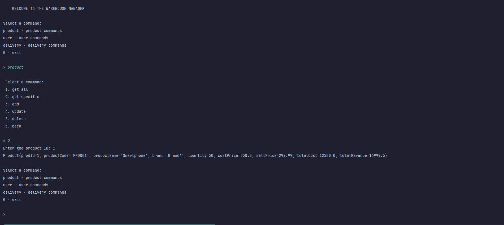

<div align="center">

# Structural Design Patterns
</div>

## Author: Copta Adrian | FAF-223

----

## Objectives:

* Get familiar with the Structural DPs.
* As a continuation of the previous laboratory work, think about the functionalities that your system will need to provide to the user.
* Implement some additional functionalities using structural design patterns.

## Used Design Patterns:

* Bridge
* Composite
* Decorator

----

## Implementation
Previously, we developed our inventory management system by implementing some
creational design pattern, our project was respecting the SOLID principles and its functionality.
To add some new features to our project and maintain it clear, dry and robust, we are going to implement
some structural design patterns.

1. ### Bridge
As you remember, our warehouse system was providing us with some crud operations.
The project structure of these operations was divided in some layers:  
repository -> to work with database;  
service -> to keep the business logic isolated;  
and a complex command layer that was implementing the AbstractFactory.  
The implementation was good but if we wanted to create new entities in our database,
for each entity we would have to provide new interfaces and classes, thus it's better
to divide and organise single classes with common functionality.  
  
First thing first, we replace our `IProductRepository` and `IUserRepository` with a common 
new interface:
```java
public interface IRepository<T, ID> {
    List<T> findAll();
    T findById(ID id);
    void add(T entity);
    void update(T entity);
    void delete(ID id);
}
```
Now, we modify our repositories to implement this interface:
```java
public class ProductRepository implements IRepository<Product, Long> {

    private final Connection connection;

    public ProductRepository() {
        ConnectionFactory connectionFactory = ConnectionFactory.getInstance();
        connection = connectionFactory.getConnection();
    }
    //... Override methods
}
```
and
```java
public class UserRepository implements IRepository<User, Long> {

    private final Connection connection;

    public UserRepository() {
        ConnectionFactory connectionFactory = ConnectionFactory.getInstance();
        connection = connectionFactory.getConnection();
    }
    //... override methods
}
```
Second step to take to implement bridge is to modify also service layer.
We delete the `IProductService` and `IUserService` and create a single abstract class:
`Service` that will have a reference to repository layer. 
```java
public abstract class Service<T, ID> {
    protected IRepository<T, ID> repository;

    public Service(IRepository<T, ID> repository) {
        this.repository = repository;
    }

    public List<T> findAll() {
        return repository.findAll();
    }

    public T findById(ID id) {
        return repository.findById(id);
    }

    public void add() {
        repository.add(null);
    }

    public void update(ID id) {
        repository.update(null);
    }

    public void delete(ID id) {
        repository.delete(id);
    }
}
```
The repository attribute now acts as a bridge between these two layers. Now we make the `ProducService`
and `UserService` to extend this class.
```java
public class ProductService extends Service<Product, Long>{

    public ProductService(IRepository<Product, Long> repository) {
        super(repository);
    }
    //... 
}
```
```java
public class UserService extends Service<User, Long> {

    public UserService(IRepository<User, Long> repository) {
        super(repository);
    }
    //...
}
```
After changing the implementation in our command layer, now, when for example we want to add
a new product, the `AddProductCommand` will be initiated and will give us the opportunity to 
execute this operation:
```java
public class AddProductCommand implements Command {

    @Override
    public void execute() {
        ProductService productService = new ProductService(new ProductRepository());
        productService.add();
    }
}
```
So, in the future we can add as many entities in our db as we want, and the business logic
and structure will be maintained the same, keeping the project flexible.

2. ### Composite
Since we build a software for a warehouse, at the warehouse the orders of clients are packed
into boxes, which are packed into bigger boxes and sent to a location to be dispatched and
send to its clients addresses. So, we have to build this functionality, adn the composite 
pattern will help us.  
So since an order can have multiple products, and orders from same location 
have to be patched together (in the same truck for example), we can see a tree structure here.
We define a interface for our component (which is order):
```java
public interface IOrder {
    double getTotalCost();
    void addProduct(Product product, int quantity);
    void display();
    String getOrderInfo();
}
```
Now, as a leaf we have an order which can have multiple products:
```java
public class Order implements IOrder {
    private final String orderId;
    private List<OrderItem> items;

    public Order(String orderId) {
        this.orderId = orderId;
        this.items = new ArrayList<>();
    }

    private class OrderItem {
        Product product;
        int quantity;

        OrderItem(Product product, int quantity) {
            this.product = product;
            this.quantity = quantity;
        }
    }
    //...addProduct(); getTotalCost(); display(); getOrderInfo();
}
```
and as a composite class we have our bigger box (truck) with individual orders:
```java
public class CompositeOrder implements IOrder {
    private String groupId;
    private String groupType;
    private List<IOrder> orders;

    public CompositeOrder(String groupId, String groupType) {
        this.groupId = groupId;
        this.groupType = groupType;
        this.orders = new ArrayList<>();
    }

    public void addOrder(IOrder order) {
        orders.add(order);
    }

    public void removeOrder(IOrder order) {
        orders.remove(order);
    }
    //...addProduct(); getTotalCost(); display(); getOrderInfo();
}
```
Now, we can operate with orders the same way by making use of the common interface.
```java
@Override
    public void execute() {
        Product prod1 = productService.findById(1L);
        Product prod2 = productService.findById(2L);

        Order order1 = new Order("ORD-001");
        order1.addProduct(prod1, 1);
        order1.addProduct(prod2, 2);

        Order order2 = new Order("ORD-002");
        order2.addProduct(prod2, 3);

        CompositeOrder cityOrders = new CompositeOrder("NYC-001", "CITY");
        cityOrders.addOrder(order1);
        cityOrders.addOrder(order2);

        deliveryService.processOrder(order1);
        deliveryService.processOrder(order2);
        deliveryService.processOrder(cityOrders);
    }
```

3. ### Decorator
Now, if a client pays for the order to be delivered extra fast, or other new features our company 
provides, we also have to handle this, but instead of creating new leafs for our `IOrder` we
will just use the Decorator Design Pattern that will help us attach new be behaviors to our 
already existing order.
So our component will be the same: `IOrder`, but we will create an extra interface for our
new behaviors:
```java
public interface OrderDecorator extends IOrder {
    String getDescription();
    double getAdditionalCost();
}
```
and will create a base for our order decorators, to be able to implement the for our components
which is `Order`:
```java
public abstract class BaseOrderDecorator implements OrderDecorator {
    protected IOrder decoratedOrder;

    public BaseOrderDecorator(IOrder order) {
        this.decoratedOrder = order;
    }

    @Override
    public double getTotalCost() {
        return decoratedOrder.getTotalCost() + getAdditionalCost();
    }

    @Override
    public void display() {
        decoratedOrder.display();
        System.out.println("Additional Service: " + getDescription() +
                " (+" + getAdditionalCost() + ")");
    }

    @Override
    public String getOrderInfo() {
        return decoratedOrder.getOrderInfo() + " + " + getDescription();
    }
}
```
Now, we can create as many concrete decorators we want, and they will implement the same interface
as the `BaseOrderDecorator`, for example an express delivery decorator:
```java
public class ExpressDeliveryDecorator extends BaseOrderDecorator {
    private static final double EXPRESS_FEE = 25.0;

    public ExpressDeliveryDecorator(IOrder order) {
        super(order);
    }

    @Override
    public String getDescription() {
        return "Express Delivery";
    }

    @Override
    public double getAdditionalCost() {
        return EXPRESS_FEE;
    }

    @Override
    public void addProduct(Product product, int quantity) {
        decoratedOrder.addProduct(product, quantity);
    }
}
```
and an insurance decorator:
```java
public class InsuranceDecorator extends BaseOrderDecorator {
    private static final double INSURANCE_RATE = 0.05;
    private static final double MIN_INSURANCE_FEE = 10.0;

    public InsuranceDecorator(IOrder order) {
        super(order);
    }

    @Override
    public String getDescription() {
        return "Insurance Coverage";
    }

    @Override
    public double getAdditionalCost() {
        double insuranceFee = decoratedOrder.getTotalCost() * INSURANCE_RATE;
        return Math.max(Math.round(insuranceFee * 100.0)/100.0, MIN_INSURANCE_FEE);
    }

    @Override
    public void addProduct(Product product, int quantity) {
        decoratedOrder.addProduct(product, quantity);
    }
}
```
Thus, our code does not care either it works with initial `Order` class or the decorated one,
since all decorator implement the same interface as the base decorator class.
Example of its implementation:
```java
@Override
    public void execute() {
        Product prod1 = productService.findById(1L);
        Product prod2 = productService.findById(2L);

        IOrder expressOrder = new ExpressDeliveryDecorator(new Order("ORD-003"));
        expressOrder.addProduct(prod1, 1);

        IOrder insuredOrder = new InsuranceDecorator(new Order("ORD-004"));
        insuredOrder.addProduct(prod1, 2);

        IOrder complexOrder = new InsuranceDecorator(
                new ExpressDeliveryDecorator(new Order("ORD-005"))
        );
        complexOrder.addProduct(prod1, 1);
        complexOrder.addProduct(prod2, 1);

        deliveryService.processOrder(expressOrder);
        deliveryService.processOrder(insuredOrder);
        deliveryService.processOrder(complexOrder);
    }
```

-----

## Conclusions / Screenshots / Results
In conclusion, the task of this laboratory work was successfully covered, 
implementing bridge, composite and decorator design patterns, 
making our project more flexible, abstract and robust.
The structural design pattern gave the opportunity to develop new features for this project,
keeping its new structures flexible and efficient.   

<small>Result implementing Bridge:</small>  
  
<small>Result implementing Composite:</small>  
  
<small>Result implementing Decorator:</small>  
  


----