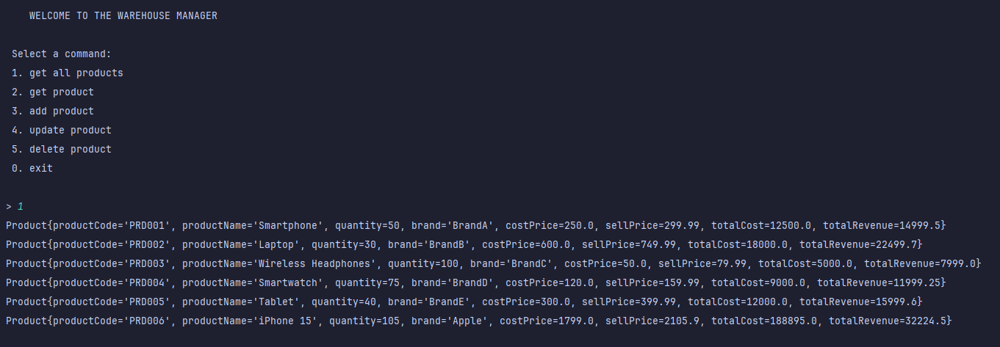
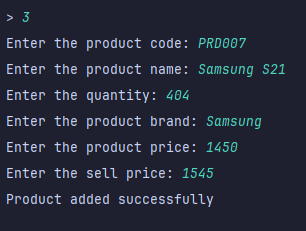
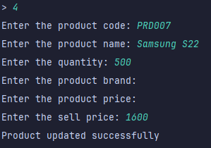
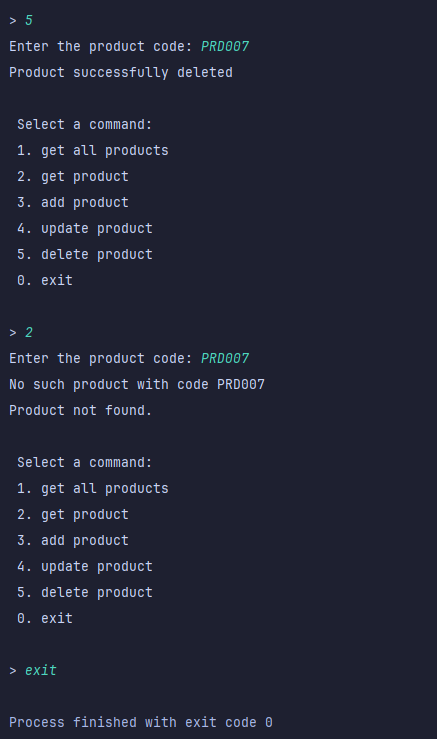

<div align="center">

# Laboratory #0
## Inventory Managements System

</div>

## Author: Copta Adrian | FAF-223

----

## Objectives:

* To get familiar with SOLID principles in designing software.
* To implement 2 SOLID principles in a simple project.

## What is SOLID?
* SOLID is an acronym for 5 OOP design principles.
* The intent is to make software:
  * more understandable
  * easier to maintain and test
  * extendable

----

## Implementation

In this project, 
I developed an Inventory Managements System (that respects and implements the SOLID principles) that simulates a simple warehouse environment.
The system allows users to perform basic CRUD operations with the products stored in the inventory.

1. ### Single Responsibility Principle

    The SRP is followed by ensuring that each class has one specific responsibility. The Product class is responsible for managing product-related data, the ProductService class handles the business logic related to product operations, and the ProductRepository class manages the persistence of product data. This ensures a clear separation of concerns and easier maintenance.
    ```java
    public class Product {
        private Long prodId;
        private String productCode;
        private String productName;
        private String brand;
        private int quantity;
        private Double costPrice;
        private Double sellPrice;
        private Double totalCost;
        private Double totalRevenue;

        public Product() {
        }
   
   //Here we have only Getters and Setters... 
   }
   ```
   The Product Class is responsible only for initiating the entity, and for operations with products we create the ProductService class, and ProductRepository for saving and getting the data.
2. ### Open Closed Principle
    The OCP is implemented in the project by using the command classes for each separate command. For example, we have CRUD operations, each operation is a class.
    Then we have a Command interface implemented by CommandExecutor class, 
    ```java
   public class CommandExecutor {
        private final Map<String, Command> commandMap;
        private final Scanner scanner;
        private final Printer printer;

        public CommandExecutor() {
            commandMap = new HashMap<>();
            scanner = new Scanner(System.in);
            printer = new Printer();
        }

        public void register(String commandKey, Command command) {
            commandMap.put(commandKey, command);
        }

        public void run() {
            boolean quit = false;
            while (!quit) {
                printer.printMenu();
                System.out.print("> ");
                String input = scanner.nextLine();
                if (input.equals("0") || input.equalsIgnoreCase("exit")) {
                    quit = true;
                    scanner.close();
                } else {
                    Command command = commandMap.get(input);
                    if (command != null) {
                        command.execute();
                    } else {
                        System.out.println("Invalid input: " + input);
                    }
                }
            }
        }       
    }
    ```
   Now, in our Main class we add each command class to the hash map of our executor
   ```java
   public class Main {

        public static void main(String[] args) {
            IProductRepository productRepository = new ProductRepository();
            IProductService productService = new ProductService(productRepository);
            CommandExecutor executor = new CommandExecutor();

            executor.register("1", new GetAllProductsCommand(productService));
            executor.register("2", new GetProductByCodeCommand(productService));
            executor.register("3", new AddProductCommand(productService));
            executor.register("4", new UpdateProductCommand(productService));
            executor.register("5", new DeleteProductCommand(productService));
    
            executor.run();
        }
    }
   ```
    Thus, every time we want to add a new operation to our warehouse manager, we can just simply create a class with the operation and add it to the hash map, but not change the CommandExecutor
-----

## Conclusion

The implementation of the product manager for a warehouse has been successfully completed using the SOLID principles, effectively incorporating all of them, but not only SRP and OCP. This structured approach not only enhances code maintainability and scalability but also ensures that the system is robust and adaptable for future requirements. Overall, the project stands as a testament to the effective application of these design principles in creating a functional inventory management system.

### Output:






----


